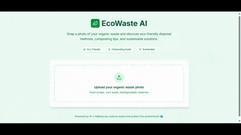

# 🌱 EcoWaste AI - Smart Organic Waste Management

[](https://nextjs.org/)
[](https://fastapi.tiangolo.com/)
[](https://python.org/)


EcoWaste AI is an intelligent waste management application that helps users identify organic waste and provides eco-friendly disposal solutions using AI-powered image recognition.

<p align="center">
  
</p>

[👉 **Try EcoWaste AI Live**](https://ecowaste-ai-git-main-humeraraheels-projects.vercel.app/)

## ✨ Features

- 📷 **AI-Powered Image Recognition** - Upload photos of organic waste for instant identification
- 🌿 **Smart Waste Classification** - Automatically categorizes different types of organic waste
- ♻️ **Eco-Friendly Solutions** - Get personalized composting and disposal recommendations
- 🎨 **Beautiful UI** - Modern, responsive design built with Next.js and Tailwind CSS
- 🚀 **Fast & Reliable** - FastAPI backend with Google Gemini AI integration
- 🌍 **Environmental Impact** - Learn about the environmental benefits of proper waste management

## 🏗️ Tech Stack

### Frontend
- **Next.js 15** - React framework with App Router
- **React 19** - Latest React with modern features
- **Tailwind CSS 4** - Utility-first CSS framework
- **Lucide React** - Beautiful SVG icons

### Backend
- **FastAPI** - Modern Python web framework
- **Google Gemini AI** - Advanced vision AI model
- **Uvicorn** - ASGI server for Python
- **Python Multipart** - File upload handling

## 🚀 Getting Started


### 🔐 Environment Setup

1. **Get your Google Gemini API Key**:
   - Visit [Google AI Studio](https://makersuite.google.com/app/apikey)
   - Create a new project or select existing one
   - Generate an API key for Gemini

### 📥 Clone the Repository

```bash
git clone https://github.com/H-raheel/ecowaste-ai.git
cd ecowaste-ai
```

## 🛠️ Installation & Setup

### Backend Setup (FastAPI)

1. **Navigate to backend directory**:
   ```bash
   cd backend
   ```

2. **Create virtual environment**:
   ```bash
   # Windows
   python -m venv venv
   venv\Scripts\activate

   # macOS/Linux
   python3 -m venv venv
   source venv/bin/activate
   ```

3. **Install dependencies**:
   ```bash
   pip install -r requirements.txt
   ```

4. **Create environment file**:
   ```bash
   # Create .env file in backend directory
   echo "GEMINI_API_KEY=your_actual_gemini_api_key_here" > .env
   ```

   **⚠️ Important**: Replace `your_actual_gemini_api_key_here` with your actual Gemini API key!

5. **Start the backend server**:
   ```bash
   uvicorn app.main:app --reload --host 127.0.0.1 --port 8000
   ```

   The backend will be available at: `http://127.0.0.1:8000`

### Frontend Setup (Next.js)

1. **Open a new terminal** and navigate to frontend directory:
   ```bash
   cd frontend
   ```

2. **Install dependencies**:
   ```bash
   npm install
   ```

3. **Create environment file**:
   ```bash
   # Create .env.local file in frontend directory
   echo "NEXT_PUBLIC_API_URL=http://127.0.0.1:8000" > .env.local
   ```

4. **Start the development server**:
   ```bash
   npm run dev
   ```

   The frontend will be available at: `http://localhost:3000`

```

## 🔧 Configuration

### Backend Configuration

Edit `backend/.env`:
```env
GEMINI_API_KEY=your_gemini_api_key_here
```

### Frontend Configuration

Edit `frontend/.env.local`:
```env
NEXT_PUBLIC_API_URL=http://127.0.0.1:8000
```

## 🎯 Usage

1. **Open your browser** and navigate to `http://localhost:3000`

2. **Upload an image** of organic waste by:
   - Clicking the upload area
   - Dragging and dropping an image
   - Taking a photo with your device camera

3. **Click "Get Eco Solutions"** to analyze the waste

4. **View the results** including:
   - Waste type identification
   - Environmental impact information
   - Step-by-step disposal/composting instructions
   - Sustainability benefits

